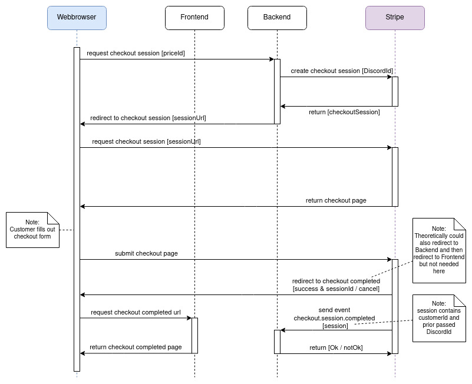

# Stripe-Vue-Node

This project is a boilerplate for a dashboard integrating Stripe using VueJS and NodeJS.

## Components

### Frontend

VueJS frontend contains client-side code.
For setup see [frontend/Readme.md](frontend/Readme.md).

### Backend

NodeJS backend contains server-side code. 
Wraps needed Stripe functions.
For setup see [backend/Readme.md](backend/Readme.md).

### Stripe-CLI

Stripe-CLI is needed for development and local testing of Stripe webhooks.
For setup see [stripe-cli/Readme.md](stripe-cli/Readme.md).

## Stripe Checkout

Following sequence starts when the user clicked _buy_ on a specific price.

